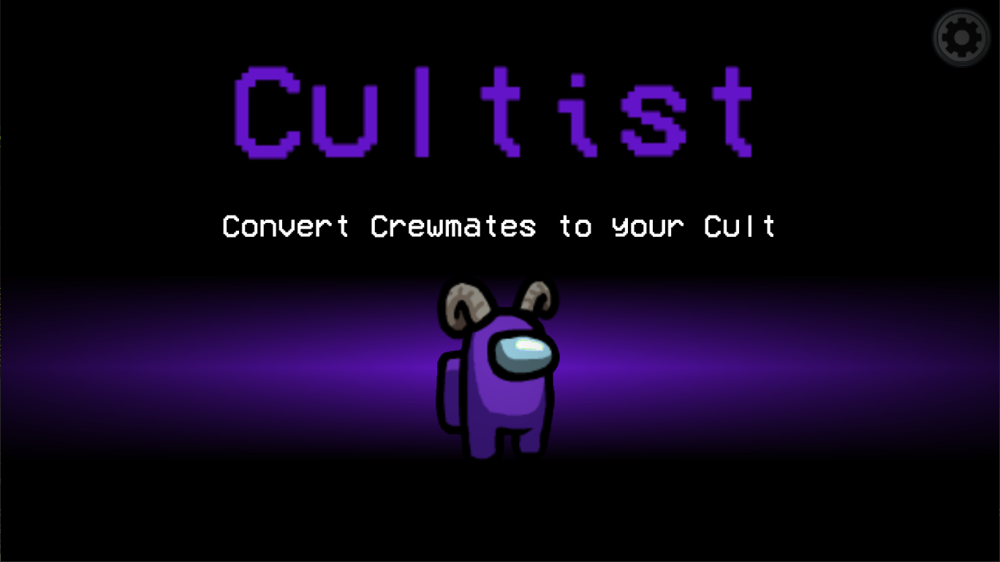

# Cultist Mod for Among Us

A mod for Among Us that adds a new faction, the Cultists. The Cultists start with a single Cultist that can
convert crewmembers to the cult. If the cult grows large enough, the Cultists win! 

# How the mod works
_If you just want to install the mod, go to [Installation](#installation)_

The mod adds a new faction to the game, the Cultists. The Cultists start with a single Cultist (The Cultist Leader) that can
convert other crew members to the cult. They can not convert Impostors. 

If there are more cultists alive than
non-cultists, the Cult wins. For example, if there are 5 players alive and 3 of them are cultists, they win.
Cultists don't have any tasks (and currently no fake tasks, so if you are new to among us, you should probably play
some games without this mod first) and if a crewmate gets converted, their tasks are removed. The Cultists have a maximum
number of conversion they can execute, when they are out of attempts they can not convert any more members.

Depending on the settings, the Cultists have a lower overall vision and the Cult leader should carefully chose who 
he wants to convert.

This mod makes for some interesting overall gameplay changes because:
* The crewmates need to make sure they not only vote out Impostors but Cultists as well, otherwise the Cult will easily win.
* The Impostors need to make sure they don't kill randomly, they need to figure out who the cultist are, and make sure that they don't make
the cultists win by killing a crewmate.
* There is a new aspect of changing your faction during the game. For example, someone who was confirmed by a med-scan, could be a Cultist later on!

# Game Settings
This mod implements a lot of settings that can heavily change the impact of the gameplay. When you are playing with the Cultist Mod,
try to find the settings that work best for your group. Depending on the settings the Cult could be very over- or underpowered, so beware!

### Enable Cultist
__Default: True__\
When enabled, the game will assign the Cultist Role to one random Non-Impostor. When disabled
the game starts without using the Cultist Mod.

### Crew Wins VS Cult
__Default: True__\
When enabled, the (non-cultist) crewmates will win when the last Impostor dies. When disabled, the game continues
and the crewmates win by either completing their tasks or by voting all Cultists out.

_Hint: This settings changes gameplay by quite a bit. For example: If enabled, the Cultists sometimes have to be careful to not vote out
the last Impostor, because they would lose instantly. This setting still might be quite buggy! I advise to keep it on True for now!_

### Fail Conversion Uses Attempt (Impostor Conversion Attempts Reduces Conversions)
__Default: True__\
When enabled, the amount of conversions will be reduced by one, even if the conversion 
target was an Impostor. The conversion will always be on cooldown after an conversion attempt, regardless of the target.

### Cult Knows Who Is Cult
__Default: False__\
When enabled, the converted Cultists will know who the other Cultists are, because their names will be marked in purple.
The Cultist Leader will always know who the other Cultists are, and all Cultists always know who the leader is.

### Pass Cult Lead on Death
__Default: True__\
When enabled, another Cultist will take the place of the Cultist Leader, if the Leader dies. When disabled, the Cult
can't recruit any more members after the Cultist Leader is dead.

### Cultist Conversions
__Default: 3__\
The maximum amount of conversions the cult can use over the course of the game.

### Cooldown Between Conversions
__Default: 60 Seconds__\
How long the cultists have to wait between conversions. __Playtesting has revealed that this is too long for the cult to be competitive in most scenarios. This will be decreased in further releases.__

### Cultist Vision Modifier
__Default: 0.7__\
The modifier for the Cultist vision. This modifier is applied to the cremates setting vor vision, so if you play with low
crewmate vision, don't turn this too low, or the Cultists will be pretty blind!

# Installation
__This mod will only work with Among Us Version v2020.12.9s__

1) Download the latest release from the releases tab.
2) Extract the files of the .zip file you just downloaded somewhere (Or just open the file with something like winRAR)
3) Go to the Among Us install directory. On Steam, right click the game, hover over manage, and click "Browse Local Files"
4) Drag every single file inside the downloaded .zip into your Among Us directory. (The folder that contains Among Us.exe)
   __Hint:__ My advise is to copy the original Among us folder and create a copy for each mod that you install. This Mod might work together with some
   other mods, but it is not guaranteed.
5) Run the game. The mod will take pretty long to start the first time, but after that, it will start at about the same speed.
6) To verify the mod is installed, look at the text in the top left of the menu screen.
7) Make sure it says "Mods: 3" and below that "Cultist Mod 1.0.0 by Aeolic"

(Basically the same as any other BepInEx/Reactor Mod, so I copied the instructions from [here](https://github.com/NotHunter101/ExtraRolesAmongUs/blob/main/README.md#instructions).)

# Usage
Using and playing this Mod is completely free. When doing a video on this mod, please link this repository and my [twitter](https://twitter.com/AeolicEDM) in the description/a pinned comment :)
It is advised that you play on a custom server and not on the official innersloth servers (although it is possible to do so).

# Bugs
With the Cultists being a third faction, there will probably be some bugs, especially some where the wrong winners are shown! I tried to handle all
possible cases, but I'm sure I forgot some :D

Please open an Issue and explain with what settings and for which constellation a bug occurred! 
If possible try to mention which role the host (the player
who hosts the lobby and who can change settings) had. Thanks you for your time and help!

If you have any other tips, improvements or questions, feel free to submit a PR or message me on discord at Aeolic#5560.

# Ideas
* Being a converted Cultist (not the leader) is kinda boring atm, I might add some special Cultist Tasks or something like that in a future Update.

# Credits:

* https://github.com/NuclearPowered/Reactor Main Framework
* https://github.com/DorCoMaNdO/Reactor-Essentials Very convenient tool for customizing the game options.
* https://github.com/NotHunter101/ExtraRolesAmongUs I learned a lot from this mod and copied quiet a bit from there :)
